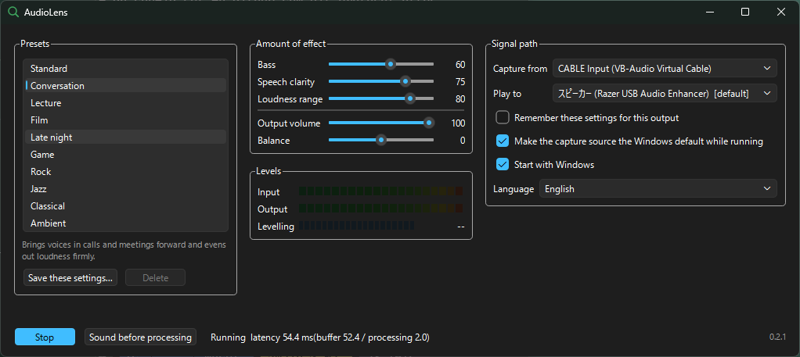

# AudioLens 0.4.0

*[日本語](README.ja.md)*

A preset-based audio assistance app for Windows that adjusts whatever the PC is
playing so it is easier to hear.



- Repository: <https://github.com/fukuyori/AudioLens>
- The version lives in `project(... VERSION ...)` in `CMakeLists.txt` and nowhere
  else. It reaches the code as `AUDIOLENS_VERSION`, and is visible in the tray
  menu and from `AudioLens.exe --version`.

Pick a preset — Conversation, Lecture, Film, Late night, Game, plus Rock, Jazz,
Classical and Ambient — and it suppresses muddy bass, lifts the frequencies
speech needs, and evens out differences in loudness. No specialist knowledge is
required: three amounts (Bass, Speech clarity, Loudness range) control the
strength of the effect, and the output volume and left/right balance sit in the
same place.

The interface is **English and Japanese**. It follows the Windows language by
default and can be set explicitly under Signal path; the change takes effect on
the next start. The Japanese catalogue is compiled into the executable, so there
is no separate file for an installer to omit or a user to delete.

## Status

**All four v1.0 success criteria met (2026-08-07).** Presets can be chosen from
the Qt 6 GUI, or from the command line, and the system audio is corrected as you
listen. A virtual audio device such as VB-Cable has to be installed separately to
serve as the capture source.

| Milestone | State |
|---|---|
| M1 engine | Implemented, measured |
| M2 DSP core | Implemented, measured |
| M3 GUI and preset storage | Implemented, confirmed on hardware |
| M3.5 robustness (N-03) | Implemented, **every path measured** (including resume from sleep and device loss) |
| N-04 default device recovery | Implemented, measured |
| M4 virtual device driver | **Cancelled.** Record of the work up to a successful build: [driver/README.md](driver/README.md) |
| M5 finishing | **Met.** All four success criteria ([docs/requirements.md](docs/requirements.md) §5) |
| F-36 command-line control | Implemented, confirmed on hardware |

One functional requirement is outstanding: **F-23, editing the EQ curve directly
in a detail mode** (low priority). It was implemented once and rejected — the
window it produced was unusable. What went wrong, and what a second attempt has
to do differently, is kept in [docs/requirements.md](docs/requirements.md)
§2.3.1. F-14 (preset export and import) was dropped: copying the JSON file
already does it (§2.2.1).

**No self-written kernel driver.** A bug in kernel mode means a blue screen or a
machine that will not boot, whereas a virtual audio device is only the way sound
gets in. A widely distributed driver carrying a Microsoft signature is the safer
choice, so VB-Cable and the like are used as the capture source.

**VB-Cable is not bundled — install it yourself.** It belongs to VB-Audio and
redistributing it needs their agreement, so the installer checks for it and says
so if it is missing, and nothing more. Its licence terms are between you and
VB-Audio: free for personal use, with a separate licence for business or
professional use. See <https://vb-audio.com/Cable/>.

The reasoning behind both is in [docs/requirements.md](docs/requirements.md)
sections 4.1 and 4.1.1.

Measured: the Film preset narrows the loudness range (EBU R128 LRA) from 17.99 to
13.13 LU. The music presets deliberately leave it alone (17.99 to 17.99 LU) —
the dynamics of a recording are the arrangement, so they are not touched. In
real time the CPU cost is 0.55 % of one core and the added latency is 2 ms.

## Building

Visual Studio with the C++ workload is enough; CMake and Ninja come with it, so
nothing else has to be installed. The GUI needs Qt 6 (the msvc2022_64 kit). It is
detected automatically under `C:\Qt` and similar, and if no kit is found the GUI
is skipped and everything else still builds.

```powershell
.\scripts\build.ps1                  # RelWithDebInfo -> build\release\bin
.\scripts\build.ps1 -Preset debug    # Debug          -> build\debug\bin
.\scripts\build.ps1 -Clean           # reconfigure from scratch
.\scripts\build.ps1 -QtDir C:\Qt\6.11.1\msvc2022_64   # point at a Qt kit
.\scripts\build.ps1 -NoGui           # skip the GUI
```

The scripts under `scripts\` are ASCII only. They are run by both PowerShell 7
and Windows PowerShell 5.1, and the two disagree about the encoding of a file
that carries no byte order mark, which turns non-ASCII text into a parse error
rather than a garbled message.

## Building an installer

Needs [Inno Setup 6](https://jrsoftware.org/isdl.php).

```powershell
.\scripts\build.ps1            # build first
.\scripts\make_installer.ps1   # then package it into dist\
```

Produces `dist\AudioLens-<version>-setup.exe`, around 34 MB.

- **It does not build.** It packages. If there is no build output it stops and
  says how to produce one. Building is `scripts\build.ps1`'s job, and a
  packaging step that quietly builds leaves "which script do I build with?"
  without an answer.
- **The version comes from `CMakeLists.txt`**, and is checked against the
  version the built binaries report. They have to agree, because bumping the
  source and forgetting to rebuild otherwise produces an installer with stale
  contents under a new name.
- **No administrator rights.** It installs under
  `%LOCALAPPDATA%\Programs\AudioLens` by default. Choosing Program Files
  elevates.
- **`.pdb` and `.ilk` are left out.** Together they are 187 MB, seven tenths of
  the build output.
- **The Visual C++ runtime** is installed only if it is missing.
- **A missing VB-Cable is reported** but does not stop the install; it can be
  added afterwards.
- **Adding to PATH is optional and off by default.** It is for people driving
  AudioLens from a shell, and it rewrites the user's PATH — a failure there is
  felt outside AudioLens — so it is only done when asked for. Uninstalling
  removes just this one entry along with its separator, and keeps the existing
  value type (normally `REG_EXPAND_SZ`), so a PATH containing `%USERPROFILE%`
  survives. An elevated install writes the machine PATH, otherwise the user's.
- **"Start with Windows" is not set by the installer.** The app manages that
  checkbox itself, and two writers of the same registry value disagree sooner or
  later.

Uninstalling asks whether to remove settings, presets and the log
(`%APPDATA%\AudioLens`).

## Running it

```powershell
$bin = ".\build\release\bin"

# The GUI, which is the normal way in
& $bin\AudioLens.exe

# --- driving the running app from a shell, a hotkey or a batch file ---
#
# These reach the copy of AudioLens that is already running and take effect at
# once. If none is running, the ones that change something start it with them
# applied, and the ones that only ask a question say so and stop rather than
# launching an app in order to report that it is running. Launching with no
# options at all brings the window to the front, so a second launch can no
# longer end up as a second instance fighting over the default output device.

# --preset takes one of ten ids. The name shown on screen works too, in
# whichever language the interface is running in.
#   standard  conversation  lecture  movie  night  game
#   rock      jazz          classical      ambient
& $bin\AudioLens.exe --preset movie
& $bin\AudioLens.exe --preset Film              # the displayed name also works
& $bin\AudioLens.exe --volume 60 --balance -5
& $bin\AudioLens.exe --volume-step -5          # for a volume hotkey
& $bin\AudioLens.exe --bass 20 --clarity 80    # applied after --preset, always
& $bin\AudioLens.exe --toggle                  # processing on/off
& $bin\AudioLens.exe --bypass on               # hear it before processing

# Where the sound goes, and where it is picked up. Part of the name is enough.
# A name matching more than one device is refused, with the candidates listed:
# picking the wrong output is a mistake only ever noticed as silence.
& $bin\AudioLens.exe --output USB2.0
& $bin\AudioLens.exe --output "Speakers (Razer USB Audio Enhancer)"
& $bin\AudioLens.exe --input "CABLE Input"

& $bin\AudioLens.exe --quit                    # exit, giving the device back
& $bin\AudioLens.exe --help                    # every option, with its range

# Reading the answer needs the shell to wait, which it does not do for a
# windowed program: the text otherwise lands after the prompt has returned.
Start-Process -Wait -NoNewWindow $bin\AudioLens.exe -ArgumentList '--status'
Start-Process -Wait -NoNewWindow $bin\AudioLens.exe -ArgumentList '--list-presets'
Start-Process -Wait -NoNewWindow $bin\AudioLens.exe -ArgumentList '--list-outputs'

# Exit codes: 0 = done / 1 = not running, or could not be carried out /
#             2 = bad command line (unknown option, out of range, missing value)
#   --quit alone returns 0 when nothing was running: the state asked for holds.

# --- everything below is for measurement and diagnosis ---

# List devices and presets
& $bin\audiolens_passthrough.exe --list
& $bin\audiolens_process.exe --list-presets

# Correct the system audio with a preset and send it to another device.
#   --capture takes a *render* device, which is tapped via loopback
#   --ab 8 toggles the processing every 8 seconds so the effect can be compared
& $bin\audiolens_passthrough.exe --capture "CABLE Input" --render "Headphones" --preset movie --ab 8

# --takeover makes the capture device the system default while it runs
& $bin\audiolens_passthrough.exe --capture "CABLE Input" --render "Headphones" --takeover

# Recovery when the default output was left on the virtual cable and there is no sound
& $bin\audiolens_passthrough.exe --set-default "Headphones"

# Exercise following a device change (N-03) by changing a sample rate and putting it back
& $bin\audiolens_passthrough.exe --invalidate "CABLE Input"

# Log the ring fill and the resampler trim every 20 ms to a CSV.
#   A diagnostic for watching the drift control in time. The five-second status
#   line aliases everything faster than ten seconds, so this resolution is what
#   the difference between a real effect and an artefact depends on.
& $bin\audiolens_passthrough.exe --capture "CABLE Input" --render "Headphones" --fill-log fill.csv

# Process a WAV offline and measure the effect
& $bin\audiolens_process.exe --input in.wav --output out.wav --preset movie

# Separate the contribution of each stage (mid/side, slow levelling, de-esser)
& $bin\audiolens_process.exe --input in.wav --output out.wav --preset movie --no-midside
& $bin\audiolens_process.exe --input in.wav --output out.wav --preset movie --no-autogain
& $bin\audiolens_process.exe --input in.wav --output out.wav --preset movie --no-deesser

# Unit tests (no hardware required, 123 of them)
& $bin\audiolens_tests.exe

# Process loopback spike (used to settle option E; the answer was no)
& $bin\audiolens_procloop.exe --list
& $bin\audiolens_procloop.exe --pid <PID> --auto-mute 6 --duration 14
```

Install a virtual audio device such as VB-Cable by hand, make it the system
default output, and name it to `--capture`. The self-written driver (M4) is
frozen, so this arrangement is the final one.

## Investigating a fault

The GUI writes to `%APPDATA%\AudioLens\audiolens.log`, rotating one generation at
a megabyte. **A fault that did not happen in front of you can only be found
here** — a windowed process has nowhere to send stderr, so previously nothing
was kept at all.

```powershell
Get-Content "$env:APPDATA\AudioLens\audiolens.log" -Tail 40
```

Unplugging a device, changing the default device and resuming from sleep all
appear here.

## Licence

**Apache License 2.0** ([LICENSE](LICENSE)), except for `driver/`, which is
**Microsoft Public License (MS-PL)**.

`driver/` derives from `audio/simpleaudiosample` in Microsoft's
[Windows-driver-samples](https://github.com/microsoft/Windows-driver-samples).
MS-PL 3(D) requires distribution in source form to remain under MS-PL, so that
part alone falls outside the Apache 2.0 grant. Keep the Microsoft copyright
notices in each file. See [NOTICE](NOTICE) and
[driver/LICENSE-MS-PL.txt](driver/LICENSE-MS-PL.txt).

## Documentation

**The documents below are in Japanese.** They are working notes — what was
measured, what was got wrong and what the numbers were — and they are written in
the language they were thought in. This README is the English entry point.

| Document | Contents |
|---|---|
| [CHANGELOG.md](CHANGELOG.md) | Notable changes, newest first |
| [docs/requirements.md](docs/requirements.md) | Requirements (functional, non-functional, acceptance criteria) |
| [docs/architecture.md](docs/architecture.md) | Architecture (approach, DSP design, roadmap) |
| [docs/m1-engine-notes.md](docs/m1-engine-notes.md) | M1 notes (drift correction, measured latency, known limits) |
| [docs/m2-dsp-notes.md](docs/m2-dsp-notes.md) | M2 notes (DSP design, measured preset effects, defects found) |
| [docs/m3-gui-notes.md](docs/m3-gui-notes.md) | M3 notes (why Qt, screen layout, settings storage, defects found) |
| [docs/m3.5-robustness-notes.md](docs/m3.5-robustness-notes.md) | M3.5 notes (resampler, drift control, following device changes) |
| [driver/README.md](driver/README.md) | M4 virtual device driver (licence, build prerequisites, test signing, the road to official distribution) |

## Repository layout

```
src/app/               Qt 6 GUI (main window, tray, settings storage)
src/common/            logging, COM/handle RAII wrappers, denormal handling
src/engine/            WASAPI capture and render, ring buffer, format conversion
src/dsp/               filters, compressor, limiter, mid/side, de-esser,
                       slow levelling, the DSP chain
src/core/              presets and the slider mapping
src/analysis/          loudness measurement (ITU-R BS.1770-4 / EBU R128)
src/audiofile/         WAV input and output
src/tools/passthrough/ capture -> correct -> render CLI
src/tools/process/     offline WAV processing and measurement CLI
src/tools/tone/        signal generator CLI (to a device or a WAV)
src/tools/procloop/    process loopback spike CLI (used to settle option E)
tests/                 offline unit tests
scripts/               build, installer, soak and recovery tests
installer/             Inno Setup script
docs/                  design documents
```
